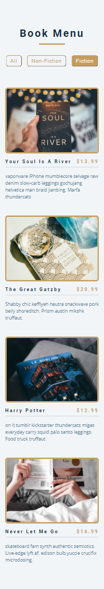
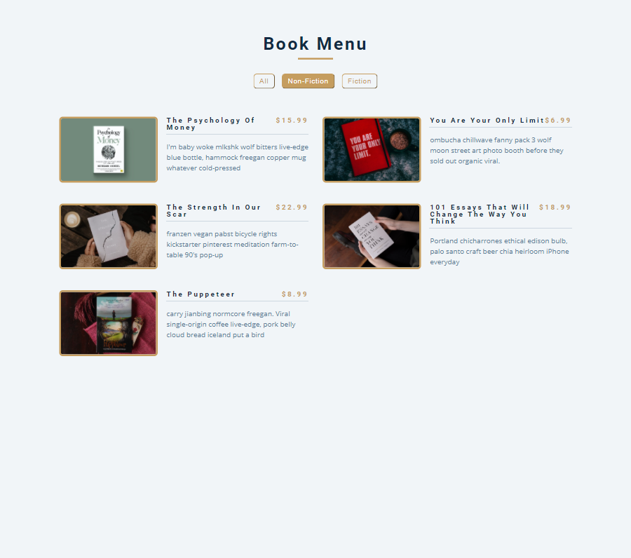

# Book_Menu

This is a JavaScript project of a book page. The books were dynamically added to the page using javaScript DOM. There are buttons to sort the books accorfing to their category. The Buttons were dynamically added to the page as well.

- 
- 
- 

## :red_circle: Live Demo

[Live Preview Link](https://gunjuzone.github.io/Book_Menu/)

## :hammer: Built With

- HTML, CSS and JavaScript

To get a local copy up and running follow these simple steps:

1. Go to the [repository page](https://github.com/Gunjuzone/Book_Menu).
2. git clone the repository using git command `git clone <link>`.
3. cd into the folder
4. git checkout branchName (mobile-version) using git command `git checkout <branchName>`.
5. Open home.html or about.html with live server

## :blue_book: Learning Objectives

- Use JavaScript DOM to add content to a page and use buttons to select and sort the content of the page.
- Demonstrate ability to create UIs adaptable to different screen sizes using media queries.
- Apply best practices in HTML code.
- Use CSS selectors correctly.
- Use Flexbox to place elements in the page.
- Demonstrate ability to create UIs adaptable to different screen sizes using media queries.
- Use GitHub Pages to deploy web pages.
- Apply JavaScript best practices and language style guides in code.
- Use JavaScript events.

## Authors

👤 **Shakiru Olagunju**

- GitHub: [@Gunjuzone](https://github.com/Gunjuzone)

## 🤝 :raised_hand: :raised_hand: Contributions

Contributions, issues, and feature requests are welcome!

Feel free to check the [issues page](https://github.com/Gunjuzone/Book_Menu/issues1).

## :grey_exclamation: Acknowledgments

- [John Smilga](https://www.johnsmilga.com/)

## 📝 License

This project is [MIT](LICENSE) licensed.
